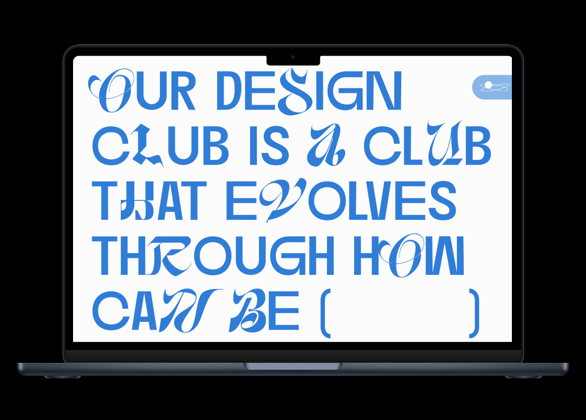
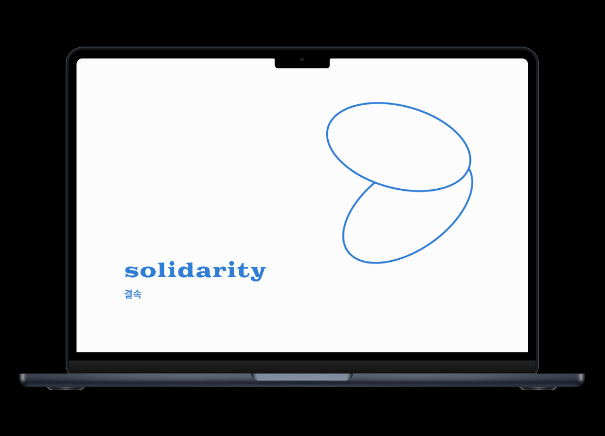
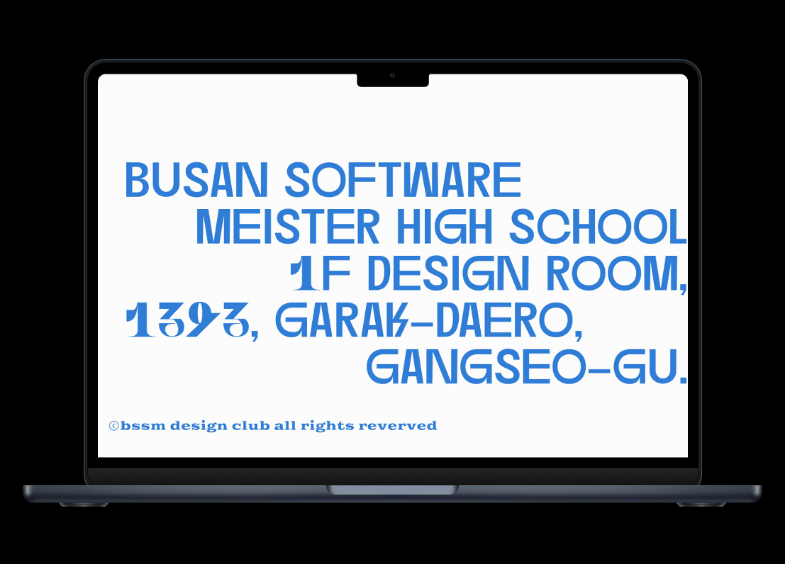
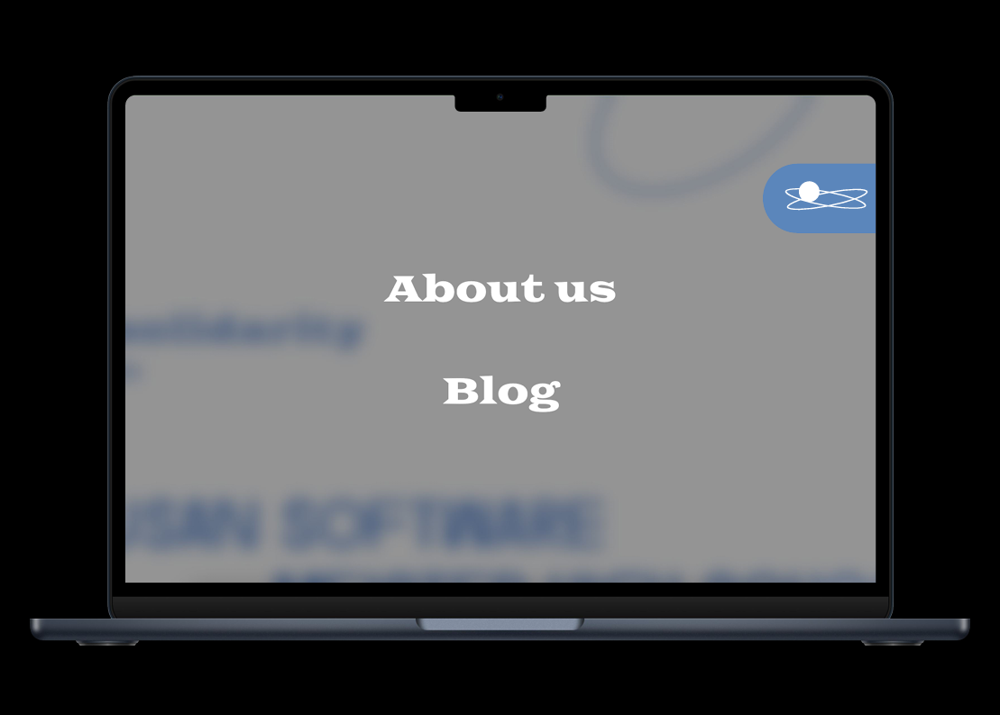
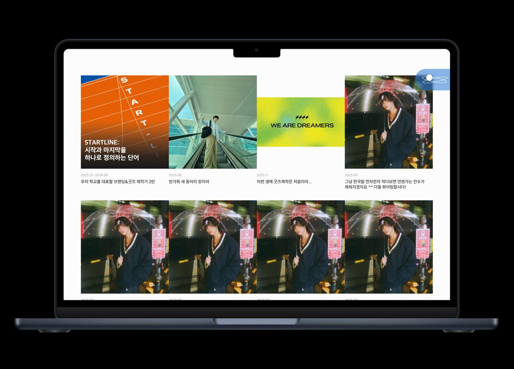
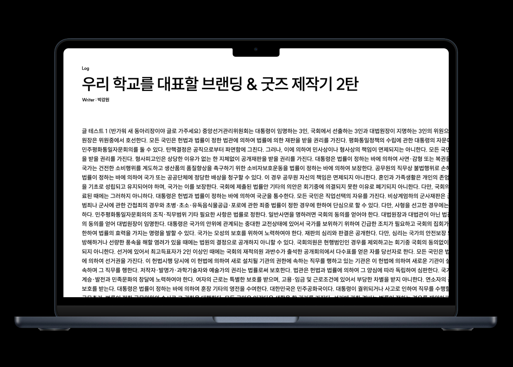

# BSSM 디자인 동아리 소개 웹 페이지 제작
----
## 프로젝트 설명
### 1) 개발기간
6/7 ~ 7/3

### 2) 팀구성(역할 포함)
이재현 : 개발
박강원 : 디자인, 개발

### 3) 작품을 제작한 이유
디자인 동아리가 줄 수 있는 경험이 뭘까?
디자인으로써 사람들이 느끼는 게 뭘까?
디자인 동아리는 앞으로 어떻게 성장해나가야 할까?

### 4) 시연영상
http://naver.me/5YFuPlt1

### 5) 기능설명(각 페이지별로 화면과 기능 설명)

히어로 화면
How Can Be()라는 정신을 담은 히어로 페이지입니다.

Spirit
디자인 동아리가 가지고 계승해나갈 정신들을 보여주는 페이지입니다.

Footer
정보를 예쁘지만 가독성이 좋도록 담은 페이지입니다.

DIM
오른쪽에 플로팅 버튼을 누르면 나오는 화면이며 페이지 이동이 가능합니다.
실제로 보면 플로팅 버튼의 크기는 작습니다.

Blog
블로그는 단순한 글쓰기 용도뿐만 아니라 디자인 동아리의 포트폴리오를 채우는 공간입니다.

블로그는 단순한 글쓰기 용도뿐만 아니라 디자인 동아리의 포트폴리오를 채우는 공간이기도 합니다.

---
## 개발하면서 느낀점(좋았던 점, 아쉬웠던 점)
누구나 사용하기가 힘들다. 좀 더 유지보수가 필요하겠다.
---
## 향후 계획 (작품 및 공부에 대한 계획) 
실제로 디자인 동아리가 사용할 수 있도록 유지 보수하며 계승할 계획이 있다.